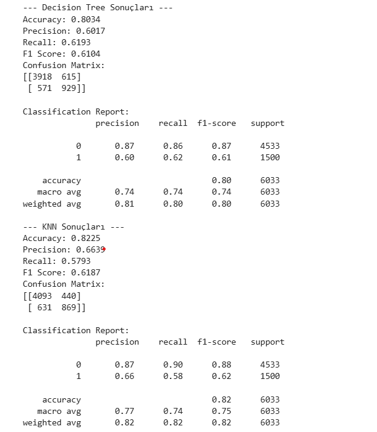

# Adult Income Prediction Projesi

## Proje Hakkında

Bu proje, Adult veri seti kullanılarak bireylerin yıllık gelirlerinin (`income`) 50K USD üzeri veya altı olup olmadığını tahmin etmeye yöneliktir. Veri seti, ABD nüfusunun demografik ve mesleki bilgilerini içerir. Projenin amacı, verilen özelliklere dayanarak kişilerin yıllık gelir seviyesini sınıflandırmak ve böylece gelir tahmini problemi üzerine uygulanabilir bir makine öğrenimi modeli geliştirmektir.

Gerçek hayatta, bu tür bir sınıflandırma modeli, bankacılıkta kredi riski analizi, pazarlama kampanyalarında hedef kitle belirleme, iş gücü planlaması ve sosyo-ekonomik araştırmalarda faydalı olabilir.

---

## Kullanılan Veri Seti

- Kaynak: [Adult Dataset - UCI Machine Learning Repository](https://www.kaggle.com/datasets/uciml/adult-census-income)
- Veri yapısı: 48.842 satır, çeşitli sayısal ve kategorik özellikler
- Özellikler: yaş, iş tipi, eğitim durumu, medeni durum, meslek, cinsiyet, çalışma saatleri vb.
- Hedef değişken: `income` (gelir >50K veya <=50K)

---

## Projede Yapılanlar

1. **Veri İncelemesi ve Görselleştirme:**
   - Veri seti ilk olarak incelendi (`data.info()`, `data.head()`).
   - Kategorik değişkenlerin dağılımları seaborn kütüphanesi ile grafiksel olarak gösterildi.

2. **Veri Ön İşleme:**
   - Kategorik değişkenler Label Encoding yöntemiyle sayısal hale dönüştürüldü.
   - Eğitim ve test verisi %80 - %20 oranında ayrıldı.
   - Özellikler StandardScaler kullanılarak ölçeklendirildi.

3. **Model Seçimi ve Hiperparametre Optimizasyonu:**
   - KNN (K-Nearest Neighbors) algoritması seçildi.
   - `GridSearchCV` ile `n_neighbors`, `weights` ve `p` parametreleri optimize edildi.
   - En iyi parametreler GridSearchCV sonucu belirlendi.

4. **Model Kaydetme:**
   - Eğitilen model, scaler ve encoder objeleri `joblib` ile dosyaya kaydedildi.
   
5. **Streamlit ile Web Arayüzü:**
   - Kullanıcıların model üzerinde kolayca tahmin yapabilmesi için basit bir web arayüzü geliştirildi.

---

## Model Karşılaştırması: Decision Tree vs KNN

Projede iki farklı sınıflandırma algoritması olan **Decision Tree** ve **K-Nearest Neighbors (KNN)** modelleri performans açısından karşılaştırıldı. Her iki model de aynı veri üzerinde eğitildi ve test edildi. Karşılaştırma için kullanılan metrikler başlıca:

- Accuracy (Doğruluk)
- Precision (Kesinlik)
- Recall (Duyarlılık)
- F1-Score

**Sonuçlar:**

| Model                      | Accuracy | Precision | Recall | F1-Score |
|----------------------------|----------|-----------|--------|----------|
| Decision Tree              | 0.80     | 0.60      | 0.62   | 0.61     |
| K-Nearest Neighbors (KNN)  | 0.82     | 0.66      | 0.57   | 0.61     |


---

### Görsel Karşılaştırma

Aşağıda her iki modelin performans metriklerinin karşılaştırıldığı ekran görüntüsü yer almaktadır:




---

## Model Tercih Sebebi

- **KNN modeli**, grid search ile optimize edilen hiperparametreleri sayesinde daha yüksek F1 skoruna ulaşmıştır.
- **Decision Tree** ise hızlı ve yorumlanabilir olmasına karşın KNN kadar performans göstermemiştir.
- Bu nedenle, proje kapsamında KNN modeli tercih edilmiştir.

---

## Projenin Gerçek Hayattaki Kullanım Alanları

- **Finans:** Kredi başvurularının değerlendirilmesi, risk analizi.
- **İK ve İşe Alım:** Gelir ve pozisyon tahmini ile iş gücü planlaması.
- **Pazarlama:** Gelire göre hedef kitle segmentasyonu.
- **Sosyo-ekonomik Analiz:** Gelir dağılımı ve demografik çalışmalar.

---

## Geliştirme İmkanları

- **Model Çeşitlendirme:** Random Forest, XGBoost gibi güçlü algoritmalar denenebilir.
- **Veri İşleme:** Eksik veriler için farklı imputasyon yöntemleri uygulanabilir.
- **Özellik Mühendisliği:** Yeni özellikler oluşturulabilir veya gereksiz özellikler çıkarılabilir.
- **Model Performansı:** Hiperparametre optimizasyonu farklı metriklerle (ROC-AUC, Precision-Recall) genişletilebilir.
- **Web Arayüz:** Kullanıcı deneyimi iyileştirilerek daha kapsamlı arayüzler geliştirilebilir.
- **Gerçek Zamanlı Tahmin:** Model API olarak deploy edilip gerçek zamanlı veri ile kullanılabilir.

---
## Canlı Demo

Projeyi canlı olarak [Streamlit Uygulaması](https://maastahmini-dtp896frrr64rlmanla7es.streamlit.app) üzerinden deneyebilirsiniz.

---
## Performans ve Sonuçlar

Model, en iyi parametreler ile eğitildi:

- n_neighbors: 7  
- weights: distance  
- p: 2 (Euclidean mesafesi)  

Performans metrikleri test verisinde raporlanabilir (accuracy, f1-score vb.).  
Model genel olarak gelir sınıflandırmasında dengeli bir performans gösterdi.

---
## Kaggle Notebook Linki

Projeye ait detaylı analiz ve model eğitimi için Kaggle Notebook:  
([https://www.kaggle.com/username/adult-income-prediction](https://www.kaggle.com/code/elifsudeyilmaz/maastahmini))  

---

## Teşekkürler

-Geri bildirim ve katkılarınızı beklerim!

---
## Kullanım

- Proje dosyaları arasında `model.pkl`, `scaler.pkl` ve `encoders.pkl` bulunur.
- `app.py` Streamlit arayüzü, model ile kullanıcıdan alınan veriler üzerinden tahmin yapar.
- Modeli yeniden eğitmek için `GridSearchCV` parametreleri ve eğitim süreci `train.py` dosyasında yer alabilir (varsa).

```bash
streamlit run app.py
